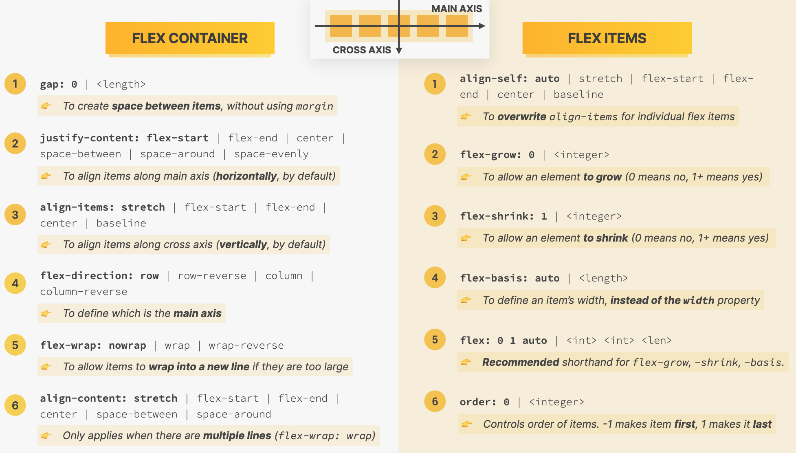

# html_and_css

* https://www.udemy.com/course/design-and-develop-a-killer-website-with-html5-and-css3/
* Author's Repo: https://github.com/jonasschmedtmann/html-css-course
* Flexbox and CSS Grid: https://github.com/nuthanc/angular_advanced_fast/blob/main/flexbox_css_grid/README.md
* Author's Instruction in **author.md**

### Resources

* https://codingheroes.io/resources/
* Download Course Resources from 1st section

### Static and Dynamic Sites

* Static: Files served as is
  * Just Web Server is required
* Dynamic: Files generated dynamically(assembled on server) and served
  * Interaction with Database, Backend(Node, Python, PHP)

### HTML Fundamentals

* Anatomy of an html element
  * Opening tag
  * Content: Content of the element or another element(Child element)
    * Some elements like img have no content
  * Closing tag
* Doctype specifying the version of the html
* html element containing head and body
* Headings from h1 to h6
* Each page should have **1 h1 heading**
* **strong**(semantic meaning) instead of **b**
* **em**(emphasize) instead of **i**
* **img** element
  * src attribute in img element
  * alt attribute important in img element(Screen readers)
  * width attribute automatically takes value in px(No need to specify explicitly)
  * VS Code provides width and height at the bottom for Opened images(Open post-img.png and check)
* **lang** attribute for html for specifying the language
* **meta** element with charset of UTF-8(Characters we use in English)
* Open link in new tab using target="_blank"
* External links using url and internal links by pointing to the html file
* href of **#** for going to the top of the Current Page
* **Structuring our Page**
  * nav element for Navigation containing the anchor elements
  * header element for Top Part of a Web Document or anything
    * header can be within article also
  * article element for Blog Post
  * aside: Secondary information that complements any other information(like article), also for Sidebar
  * footer element
* HTML entity(&copy;) using &(name);
* Semantic HTML: Elements have Meaning or Purpose
  * strong
  * em
  * nav instead of div for Navigation elements
  * header instead of div
  * SEO and accessibility

### Challenges

* Challenge 2: https://codepen.io/nuthan-chandra/pen/PoaewNP

### CSS

* Inline CSS
  * Inside the HTML element using `style` attribute
* Internal CSS
  * Inside the head with `style` element
* External CSS with a css file(style.css) and link it using link
  * `<link href="style.css" rel="stylesheet">`

### CSS Properties

* line-height
  * Space between the lines
  * Based on font-size, 1.5 means 1.5 times that of the font-size
  * Default 1
* Inheritance
* text-align: center
  * Center of its parent element
* font-size 16px by default
* Descendant selector
  * footer p
  * But not a good practise as it encodes the html structure into our CSS
* Separator is dash(-),e.g class="related-author"
* id to be used only once
* ul for related author, we used **class instead of id** even though it was selecting just one ul because we are **preparing for the future(potential changes)**
  * use class in real life scenario
* Boxes(Elements) containing multiple child elements are placed on top in CSS(Author's coding convention)

### Colors

* RGB Model
  * Each of the base colors take a value between 0 and 255
  * rgb(0, 255, 255)
  * RGB with transparency("alpha") rgba(0,255,255,0.3)
  * Color Picker
* Hexadecimal Notation
  * 0 to ff(255 in hexademical) for RGB respectively
  * #00ffff
  * Shorthand for the above: #0ff
* In Practice, we mostly use Hexadecimal values and rgba is used when we need transparency
* Shades of Grey
  * When colors in all 3 channels are the same, we get a grey color. For Ex
    * rgb(0,0,0)
    * rgb(69, 69, 69) also as #444444 or #444
    * rgb(183, 183, 183) also as #b7b7b7
    * #ffffff

### Pseudo Classes

* li:first-child instead of having classes to all first items
  * All li elements that are the first child element of its parent element
* Same semantics for last-child and nth-child(3)
* nth-child also takes keywords like odd, even etc
* Misconception about first-child pseudo-class
  * article p:first-child won't select the p because it is not the first child of article
* first-child, last-child are perfect for situations where all the child elements are same like ul and ol

### Styling hyperlinks

* Simply selecting *a tag* and styling it is not a best practice
* Target pseudo class of *a tag*
* a:link targets actual links(with href)
* a:visited targets visited
* a:hover when hovered
* a:active when clicked
* LVHA in this order

### Chrome Devtools

* Shortcut: Cmd + Option + I

### Conflicts Between Selectors

* When there are multiple selectors for the same element
  * All of them are applied
  * But conflicting ones will be decided on priority
* Highest priority
  * Declarations maked by **!important** keyword(Last resort)
  * Inline styles(style attribute in html)
  * ID selector
    * Multiple: Last selector
  * Class or Pseudo-class selector
  * Element selector
  * Universal selector
* Hover over selectors in VS code to get the specificity
* Write selectors as simple as possible
  * Don't have too many nestings, classes or ids for the same element

### CSS Inheritance

* *strong element* which is inside *p* gets the style of the p element
* Some Properties get inherited from Parent to Child elements
* Not all Properties get inherited, **mostly text related**
  * font-family, font-size, font-weight, font-style, color, line-height, letter-spacing, text-align, text-transform, text-shadow, list-style etc
* For e.g: border doesn't get inherited
* Like setting properties like color for body element gets inherited by all its child elements
* Inherited values have the lowest priority
* Universal Selector
  * Properties like color are inherited(so can be applied in body)
  * Used for properties we want to apply for all elements but which does not get inherited
  * E.g border-top on all elements using Universal Selector
  * Lowest priority
  * No Inheritance involved in Universal selector

### CSS Challenge

* Author's link: https://codepen.io/jonasschmedtmann/pen/zYNyMJL/256706a9de79baf1bd19abcb68e820d9

### CSS Box Model

* Each element can be seen as a Rectangular box
* Content: Actual content of the element
  * Text, Images, Table, Video etc
  * height and width using css
* Border: A line around the element, but still **inside of the element**
* Padding: Invisible space around the content, inside of the element
* Margin: Space **outside** of the element, between elements
* Fill Area: Area that gets filled with background color or background image
  * Text and Images inside the Content Box
  * But the same doesn't apply for Background image or color
    * It applies for Content, Padding and Border

### Element Height and Width Calculation

* If height or width is not specified, it is implied based on the **Content**
* Final element width = left border + left padding + width + right padding + right border
* Final element height = top border + top padding + height + bottom padding + bottom border
* The above is default behavior

### Using Margin and Paddings

* Shorthand for top and bottom for first value and left and right for second value
```css
.main-header {
  padding: 20px 40px;
}
```
* Global reset
  * Cannot be done in body, because margin is not inherited(not a text based property)
  * Use universal selector and set margin and padding to 0
    * It's also very easy to override if required later
* It is common to use **margin-bottom** to create vertical space instead of margin-top
* ul and ol need margin-left to show the bullet points and the numbers(Because of universal selector styles)
* **Collapsing margins**
  * When 2 margins occupy the same space, only one of them(larger of the 2) is visible
  * Ex: For h3 below p, h3 margin-top 40px and p margin-bottom 15 px, only 40px takes effect

### Adding Dimensions(height and width)

* height and width are for the content
* But final width and height takes into account the padding and border as well
* width specified in css overrides width attribute(in html) of img
* In html, height and width attributes were set for the image
  * If only width is set in css, the aspect ratio goes a little weird, since it overrides width but height is still taken from the attribute
  * height: auto fixes the aspect ratio when only width is specified
* **When any one of them(height or width) is only given in css, then the other will adapt automatically in order to get the original Aspect ratio of the image**
* If we use Percentages, it is Percentage of Width of the *Parent Container*
  * Parent of post-img class element is the header and its width is the entire width of the Page

### Centering our Page

* **Put all of our content into a container element and give it a width**
* The Child elements cannot be wider than the Parent element(Only as large as the Container element)
* Then margin-left: auto and margin-right: auto
* auto for Browser to calculate and adjust automatically
* margin: 0 auto; Author did this
  * I didn't feel top and bottom necessary as we had only given width to the container
  * Height will be the size of the Page

### Challenge

* I had added extra div as container when existing article container could have been used

### Types of Boxes

* Inline boxes: Occupies space exactly what they need and don't create line breaks
  * **height and width do not apply**
  * **Padding and margin** only **applied horizontally(left and right)**
  * For padding, it looks like some space is created vertically as well, but the Content remains exactly in the same place(In block case, it would have moved down)
  * E.g: strong, a, em, button
* Block: Occupies all the space that they can(100% of parent element's width) and create line breaks after them
  * Most of the HTML elements are block level elements
  * E.g: p, div, h2, li, body, main, header, footer, section
  * If height is set, the element doesn't expand to fit the content
    * So it is commented in main-header
* Inline-Block: Looks like inline from the *outside*, behaves like block-level on the *inside*
  * Occupies only content's space and causes no link-breaks
  * Width, Height, Padding and Margin Apply
  * E.g: img

### Absolute Positioning

* Normal Flow: Default Positioning
  * Elements are simply laid out according to their order in the HTML code
  * Or by setting it to *position: relative*
* Absolute Positioning: Element is removed from the normal flow
  * No impact on surrrounding elements, might overlap them
  * We use top, bottom, left or right to offset the element from *its first relatively positioned parent container*
  * position: absolute
* Ctrl + Cmd + Space for Emoji on MAC and Wind + . in Windows
* *By default, it's positioned in relation to the Viewport*(visible part of the page)
* Check Like button's positioning
* But we don't want its positioning from Viewport, we want in relation to some other **parent** element, so we set that parent's position as relative
* We want it from the Page and that is the body element, so we set body's position to relative

### Pseudo-elements

* Don't exist in HTML, but that we can still select and style in css
* Examples
  * First letter in a paragraph
  * First line in a paragraph
* Written using 2 colons(h1::first-letter)
* + for Adjacent Sibling selector(Immediately following the first and has the same parent)
* ::after pseudo-element creates a Pseudo element that will automatically be the very last child of the selected element
  * Very useful for small cosmetic style for which we don't have to add a new element to the HTML
  * Ex: TOP article
  * Mandatory property is the **content** property
* By default, **any Pseudo-element is an inline element**
* ::before pseudo-element creates a Pseudo element that will automatically be the very first child of the selected element

### Developer Skill

* Google for things like "css center anchor elements"
* Also check out documentation like "css mdn text align"
* *HTML Validator* and *Diff Checker*
* In CSS, keep selectors simple. Use Inspect from Browser

### Coding Challenge 3

* Horizontal padding double that of vertical
* Author used display: inline-block for sale class
  * It was not necessary when I added position: absolute

### Layouts

* Layout: Way in which text, images and other content is placed and arranged on a webpage
* Layout gives the page a visual structure, into which we place our content
* Page Layout and Component Layout
  * Bigger layout in the Page
  * Made out of small Components
* Check pdf for more

### 3 Ways of Building Layouts

1. Float Layouts: float css property, but this is outdated
2. Flexbox: 1-dimensional row
3. CSS Grid: 2-dimensional grid

### Using Floats

* With use of Floats, it is taken out of the Normal flow just like the Absolutely Positioned element
* Difference is **Text and Inline** elements will float around it
* The container will not adjust its height to the element
* For the element very next to the img, which is p, in our case, it is starting behind the img
  * It's as if the img is not on the page
  * So large padding and margin is required
  * To fix this, make the p element also as float: left
  * float: right would make it right side of the container
* A floated element can still add margins around it
* If we add float to h1 and nav, then the main-header(container) has zero height(Collapsing) now because all of its children are floated(Removed from the normal flow)
  * It is as if it has no child elements
  * The only reason the background color is still visible is because of the padding

### Clearing Floats

* Add an element to the container element and clear the floats
* clear works only on block elements
* A neat trick is to use ::after pseudo element and clear it from there. Note we need to make after a block level element
  * clearfix hack. Give all the parent a class of clearfix

### Building a Simple Float Layout

* Giving background-color makes it easier to see the boxes
* Need to change the width of article and aside as they are block elements and occupy 100% of the available width of the container
* We do not want footer to float around aside, so clear in it
* Instead of giving margin-right, decrease the article's width

### box-sizing: border-box

* Giving padding left and right to *aside* made it too big and now it reaches within article, so it comes down
* Final element width = left border + left padding + width + right padding + right border
* Final element height = top border + top padding + height + bottom padding + bottom border
* The above is default behavior
* box-sizing: border-box makes the width and height from one side of the border to the opposite side
* Any padding and border width or height reduces the Content's width or height
* Box-sizing is applied to every single element by specifying in Universal Selector
  * It is not specified in body as it does not get inherited

### Challenge using Layouts

* Author used float: left for both

### Introduction to Flexbox

* Flexbox and CSS Grid link: https://github.com/nuthanc/angular_advanced_fast/blob/main/flexbox_css_grid/README.md
* Slide is also very good
* Flexbox used for building 1-dimensional layouts
* Flex Container and Flex Items
* Each of the Items occupies **exactly the space it needs for its Contents**
* Vertically in our case all the Items are as tall as the Tallest element(One item given height of 150px) of the Flex Item
* Centering is very easy with align-items: center
* **Default of align-items is stretch**
* Flex Container and Flex Items Properties


### Spacing And Aligning Items

* Checkout the flexbox image
* For adding space between flex-items without space-around, we can use margin
* Or gap in the flex-container

### The flex property

* flex property shorthand for flex-grow, flex-shrink and flex-basis
* Default for flex-grow is 0, flex-shrink is 1 and for flex-basis it's auto
* flex-basis for width of the items and when the Content is larger, it fits the Content
  * Need to remove *gap* to see the flex-basis to what is being set
* Flexbox shrinks an item to fit it in the Container even when the flex-basis is too high
  * Setting flex-shrink: 0(no), then allows it to have the width specified in flex-basis
* flex-grow: 1(yes) for all elements, fills up the available space evenly between the remaining items
  * It doesn't have to be 1, it can be 1 and 2 for the other. 
  * The one having 2 will be double the size of Available empty space than the other ones
* Always use flex property

### Adding Flexbox to Our Project

* Manually giving article a flex-basis of 825px(which involves calculation) defeats the purpose of having flex-box
* So we just use flex-grow to 1 to take up available space
* Add flex: 1 to both the layouts to have equal width